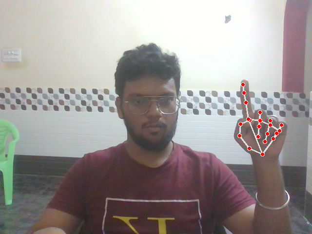
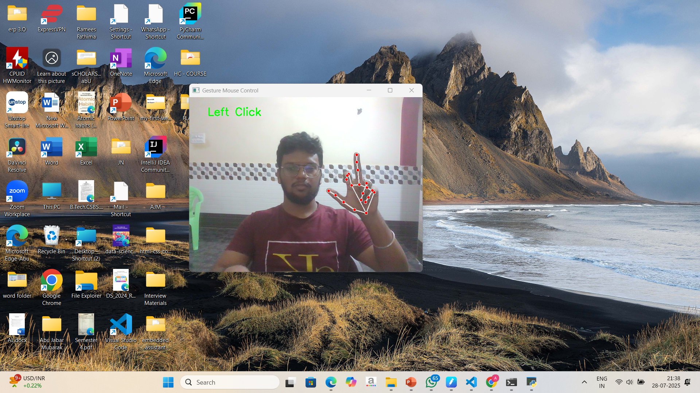
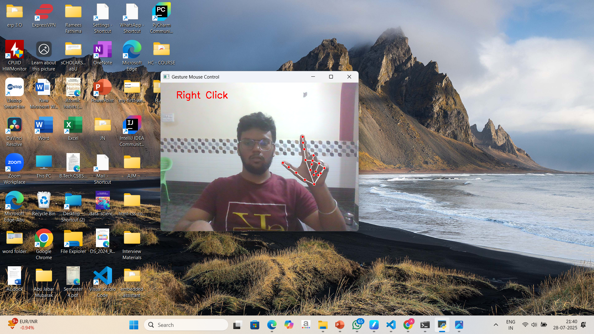
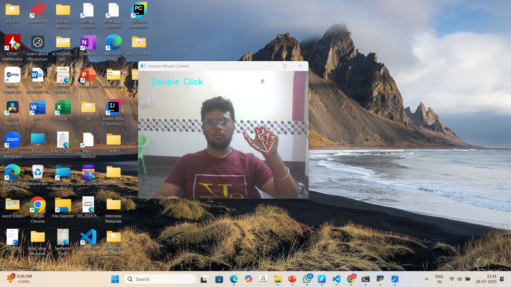
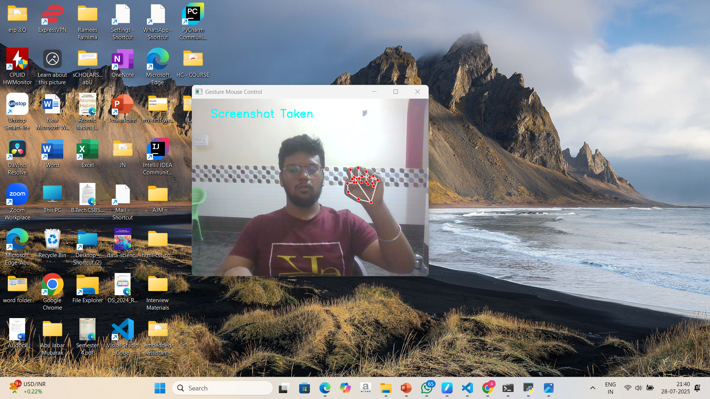

# 🖐️ Gesture Mouse Control using OpenCV + MediaPipe

Control your mouse entirely with hand gestures using your webcam and AI! This project lets you simulate mouse actions like moving the cursor, left click, right click, double click, and even take screenshots — just by showing gestures in front of your webcam.

---

## 🎯 Objective

Traditional mouse devices can be limiting or inaccessible in certain scenarios. With advancements in computer vision and AI, hand-tracking can open new ways for human-computer interaction. This project aims to demonstrate how intuitive and contactless control can be achieved using just a webcam and your hand.

---

## ✨ Features

✅ Move mouse with your index finger  
✅ Left click with a specific hand pose  
✅ Right click with another pose  
✅ Double click with finger combination  
✅ Take screenshot using gesture  
✅ Works in real-time using MediaPipe + OpenCV

---

## 🎥 Demo Images

| Gesture         | Description               | Image                        |
|----------------|---------------------------|------------------------------|
| **Move Cursor** | Move index finger         |   |
| **Left Click**  | V-shape index gesture     |    |
| **Right Click** | V-shape middle gesture    |   |
| **Double Click**| Both fingers V-shape      |  |
| **Screenshot**  | All fingers together      |    |

> 💡 You can replace the images in `images/` folder with your own screenshots.

---

## 🛠 Tech Stack

- **Python 3.10+**
- **MediaPipe** – For hand landmark detection
- **OpenCV** – For camera and image processing
- **PyAutoGUI** – For controlling the mouse and taking screenshots
- **Pynput** – Simulates actual mouse click events

---

## 📂 Project Structure

```
gesture_mouse_control/
│
├── main.py                 # Entry point of the application
├── gesture_control.py      # Logic for identifying gestures
├── hand_tracker.py         # Handles hand tracking using MediaPipe
├── util.py                 # Utility functions (angles, distances)
├── requirements.txt        # Required dependencies
├── README.md               # You're reading it 😉
├── images/                 # Screenshots for gestures
│   ├── move_cursor.png
│   ├── left_click.png
│   ├── right_click.png
│   ├── double_click.png
│   └── screenshot.png
```

---

## ⚙️ Installation

### 1. Clone this repo

```bash
git clone https://github.com/yourusername/gesture_mouse_control.git
cd gesture_mouse_control
```

### 2. Create a virtual environment

```bash
python -m venv venv
venv\Scripts\activate  # For Windows PowerShell
```

### 3. Install dependencies

```bash
pip install -r requirements.txt
```

### 4. Run the project

```bash
python main.py
```

---

## 🖐️ Gesture Logic Explained

| Gesture        | Rule Based Detection                                                                 |
|----------------|----------------------------------------------------------------------------------------|
| Move Cursor    | Thumb and index finger close, index tip tracked and mapped to screen                  |
| Left Click     | Angle of index finger bent, thumb distant                                             |
| Right Click    | Middle finger bent, angle between joints detected                                     |
| Double Click   | Both index and middle bent, angles < 50°                                              |
| Screenshot     | All fingers folded (angle < threshold), thumb-index distance < 50                    |

These rules are calculated using `get_angle()` and `get_distance()` functions in `util.py`.

---

## 🧠 How It Works

1. **MediaPipe** detects 21 hand landmarks in real time.
2. Custom logic calculates angles between finger joints.
3. Mouse movement mapped using tip of index finger.
4. Different gestures trigger corresponding mouse actions.

---

## 🔍 Troubleshooting

| Problem                          | Solution                                          |
|----------------------------------|---------------------------------------------------|
| Camera not opening               | Check if another app is using the webcam         |
| Gesture not detected             | Make sure your hand is fully visible in frame    |
| Click not working                | Adjust distance or angle thresholds              |
| ModuleNotFoundError: mediapipe   | Use Python 3.10 or 3.11 only, not 3.13           |

---

## 📸 Sample Use Cases

- Accessibility tools for people with disabilities
- Hands-free interaction in industrial or clean environments
- Innovative UI for gaming and smart screens

---

## 🙋‍♂️ Author

**Abu Jabar Mubarak**  
B.Tech in Computer Science & Business System  
Leader of multiple technical events and AI/ML challenges 💡  
GitHub: [github.com/yourusername](https://github.com/yourusername)

---

## 📄 License

MIT License — free to use, modify, and distribute. Give credits if you reuse it!

---

## 🙌 Contribute

Want to add more gestures or support dual-hand tracking? Open a PR or issue — contributions welcome!

---

## 🌟 If you like it, give this repo a ⭐ on GitHub!
